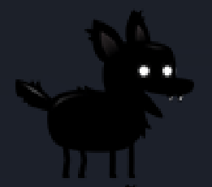

<!-- PROJECT LOGO -->
 

  

<h3 align="center">Side Scrolling Game</h3>

  

    A small scale side scrolling game about a dog
     
    <a href="https://github.com/ArchangeLillith/Side-Scrolling-Game"><strong>Explore the docs »</strong></a>
     
  

<!-- TABLE OF CONTENTS -->

  
Table of Contents

  <ol>
    <li>
      <a href="#about-the-project">About The Project</a>
      <ul>
        <li><a href="#built-with">Built With</a></li>
      </ul>
    </li>
    <li>
      <a href="#getting-started">Getting Started</a>
      <ul>
        <li><a href="#prerequisites">Prerequisites</a></li>
      </ul>
    </li>
    <li><a href="#usage">Usage</a></li>
    <li><a href="#roadmap">Roadmap</a></li>
    <li><a href="#contributing">Contributing</a></li>
    <li><a href="#license">License</a></li>
    <li><a href="#contact">Contact</a></li>
    <li><a href="#acknowledgments">Acknowledgments</a></li>
  </ol>

<!-- ABOUT THE PROJECT -->
## About The Project

A side scroling game using parallax backgrounds, state manamgement and a canvas to draw the game. This game includes logic for multiple different enemy sprite types in addition to the ability to import and use a sprite sheet. Collision detection is also worked into the game, resulting in a state change in the player character. Game over screen is yet to be implimented with final touches, but a score and the timing are functional currentlly. 

(<a href="#readme-top">back to top</a>)

### Built With

* Vanilla JavaScript, using a canvas to draw the game elements
* Vanilla CSS
* HTML

<!-- GETTING STARTED -->
## Getting Started

This game will run on most browsers, if issues occur run in Google Chrome. This was the platform I tested most on and the game ran most reliably. 

### Prerequisites

No prerequisites if all files are downloaded as they appear in the repo, or you can access the game by using <a href="https://archangelillith.github.io/Side-Scrolling-Game/">this link.</a>

<!-- USAGE EXAMPLES -->
## Usage

This game was used as a learning exercise and can either be used to recreate and learn about the logic or played as a game as it stands. 

(<a href="#readme-top">back to top</a>)

<!-- ROADMAP -->
## Roadmap

This game is close to complete, finishing touches will come in an update at some point. 

(<a href="#readme-top">back to top</a>)

<!-- LICENSE -->
## License

No licenses needed or used

(<a href="#readme-top">back to top</a>)

<!-- CONTACT -->
## Contact

Personal website: <a href='[https://ArchangeLillith.GitHub.io]'>https://ArchangeLillith.GitHub.io</a>

Project Link: [https://github.com/ArchangeLillith/Side-Scrolling-Game](https://github.com/ArchangeLillith/Side-Scrolling-Game)

(<a href="#readme-top">back to top</a>)

